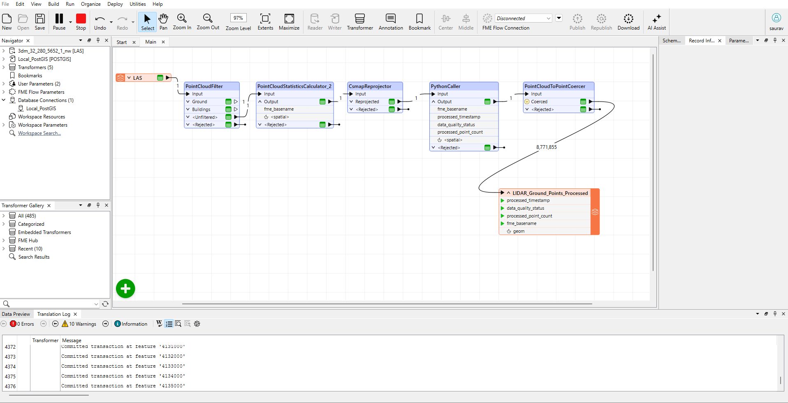

# LIDAR-ETL-Pipeline
Automated ETL pipeline using FME &amp; Python to ingest, filter, and enrich 8.7M+ Mobile Mapping (LIDAR) points into PostGIS.
# Automated Mobile Mapping ETL Pipeline (FME & PostGIS)

## 📌 Project Overview
This project demonstrates an automated **ETL (Extract, Transform, Load)** pipeline designed to ingest, validate, and enrich massive Mobile Mapping (LIDAR) datasets.

Using **FME Form** and **Python**, the pipeline processes raw `.LAS` point clouds (8.7M+ points), standardizes their coordinate systems, and loads them into a **PostgreSQL/PostGIS** database for spatial analysis.

**Key Achievements:**
* **Big Data Processing:** Successfully handled **8.7 million records** in a single run.
* **Logic Filtering:** Implemented conditional logic to segregate "Ground" vs. "Unfiltered" data.
* **Python Integration:** Embedded custom Python scripts to calculate quality metrics (`point_count`, `timestamps`).
* **Spatial Database:** Automated table creation and schema mapping in PostGIS.

## 🛠️ Tech Stack
* **ETL Tool:** Safe Software FME Form 2025
* **Scripting:** Python 3.9 (FME Python API)
* **Database:** PostgreSQL 16 + PostGIS 3.4
* **Data Format:** ASPRS LAS (Airborne/Mobile LIDAR)

## ⚙️ Architecture & Workflow



### The Pipeline Steps:
1.  **Ingest:** Read raw `.LAS` point cloud data.
2.  **Filter:** Apply `PointCloudFilter` to separate classified ground points (Class 2).
3.  **Reproject:** Convert local coordinate systems (ETRS89) to global standard (EPSG:4326/WGS84) using `CsmapReprojector`.
4.  **Enrich (Python):** A custom `PythonCaller` script calculates:
    * `processed_point_count` (Volume metrics)
    * `processed_timestamp` (Audit trail)
    * `data_quality_status` (Tagging)
5.  **Explode & Load:** Coerce point clouds into individual geometry points and load into PostGIS.

## 🐍 Python Logic
The core logic for metadata enrichment was handled via the `fmeobjects` API:

```python
import fme
import fmeobjects
from datetime import datetime

def input(self, feature):
    # Calculate point count from geometry
    geometry = feature.getGeometry()
    if geometry:
        point_count = geometry.getPointCount()
        feature.setAttribute("processed_point_count", point_count)
    
    # Add Audit Timestamp
    now = datetime.now().strftime("%Y-%m-%d %H:%M:%S")
    feature.setAttribute("processed_timestamp", now)
    
    # Tag Quality Status
    feature.setAttribute("data_quality_status", "Verified_Ground_Class")
    
    self.pyoutput(feature)
